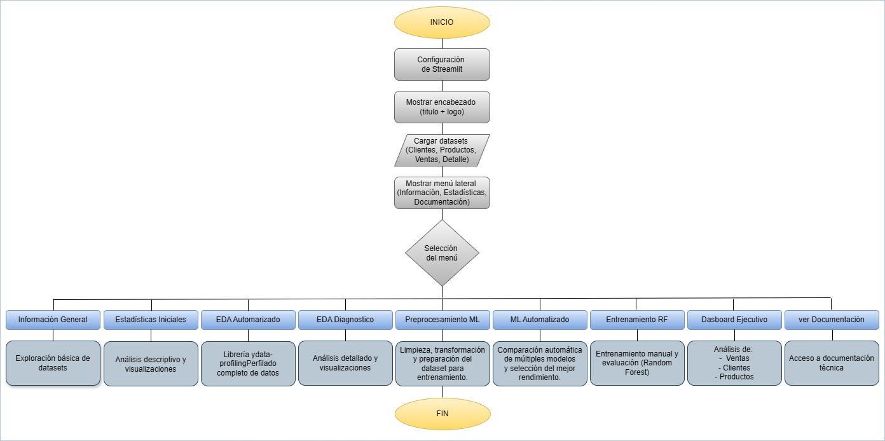

# 🛒Proyecto Tienda Aurelion – Documentación técnica

### 📚 Índice de contenidos

- [🛒Proyecto Tienda Aurelion – Documentación técnica](#proyecto-tienda-aurelion--documentación-técnica)
    - [📚 Índice de contenidos](#-índice-de-contenidos)
    - [Tema](#tema)
    - [Problema](#problema)
    - [Solución](#solución)
    - [Fuente](#fuente)
    - [Datasets: definición, columnas y tipos](#datasets-definición-columnas-y-tipos)
    - [Estructura](#estructura)
    - [Información](#información)
    - [Flujo de Usuario](#flujo-de-usuario)
    - [Pseudocódigo](#pseudocódigo)
    - [Diagrama del flujo](#diagrama-del-flujo)
    - [Interpretaciones EDA – Visualizaciones](#interpretaciones-eda--visualizaciones)
      - [🔸 Gráfica: distribucion\_numericas](#-gráfica-distribucion_numericas)
      - [🔸 Gráfica: correlacion](#-gráfica-correlacion)
      - [🔸 Gráfica: ventas\_total\_por\_mes](#-gráfica-ventas_total_por_mes)
      - [🔸 Gráfica: relacion\_cantidad](#-gráfica-relacion_cantidad)
      - [🔸 Gráfica: outliers](#-gráfica-outliers)
    - [Preprocesamiento para Machine Learning](#preprocesamiento-para-machine-learning)
    - [AutoML: Benchmarking con PyCaret](#automl-benchmarking-con-pycaret)
    - [Entrenamiento Manual: Random Forest](#entrenamiento-manual-random-forest)
    - [Dashboard Ejecutivo](#dashboard-ejecutivo)
      - [🔸 Dashboard](#-dashboard)
      - [🔸 Réplicas de Vistas](#-réplicas-de-vistas)
      - [🔸 Conclusiones](#-conclusiones)

---

### Tema

Análisis y consulta interactiva de datos de ventas de la Tienda Aurelion, una tienda minorista que desea comprender mejor el comportamiento de sus ventas, productos y clientes.

### Problema

La Tienda Aurelion enfrenta dificultades para mantener un equilibrio adecuado entre el stock disponible y la demanda real de los productos. Esto genera dos problemas recurrentes:

  - _Rupturas de stock_: cuando un producto se agota y no puede ser vendido.
  - _Exceso de inventario_: cuando se compran productos que permanecen sin rotación durante mucho tiempo.

Ambas situaciones impactan negativamente en la rentabilidad del negocio:

  - Las rupturas de stock reducen las ventas y afectan la satisfacción del cliente.
  - El exceso de inventario genera costos de almacenamiento innecesarios.

### Solución

Desarrollar un programa en Python y Streamlit que permita interactuar con los datos y consultar de forma sencilla información relevante. Utilizar los datos históricos de ventas, clientes y productos para:

  - Analizar la demanda real de cada producto.
  - Identificar los productos de mayor y menor rotación.
  - Estimar la demanda futura promedio mensual.
  - Proporcionar información visual que ayude a tomar decisiones de compra y reposición más inteligentes.

**Análisis que se puede realizar**

1. Ventas totales por producto y mes.
2. Ranking de productos más vendidos.
3. Relación entre stock disponible y ventas promedio.
4. Productos con ventas decrecientes (riesgo de exceso de stock).
5. Productos con ventas crecientes (riesgo de ruptura de stock).
6. Predicción de demanda promedio mediante una regresión lineal simple.

**Resultado esperado**

Una aplicación en Streamlit que permita:

   - Visualizar métricas de ventas y rotación.
   - Detectar los productos críticos para reposición.
   - Consultar la documentación del proyecto.


---

### Fuente

Su origen es secundario, los datasets fueron provistos por Guayerd dentro del programa de Fundamentos de Inteligencia Artificial que desarrolla junto a IBM.

_Nota_: Estos datasets son de carácter didáctico y se proporcionan solo con fines de prueba y aprendizaje, para poder estudiar y practicar el análisis de datos y la implementación de modelos.

---

### Datasets: definición, columnas y tipos

| Dataset | Descripción breve | Columnas | Tipo / Escala |
|----------|------------------|-----------|----------------|
| **clientes.xlsx** | Información de los clientes | id_cliente<br>nombre_cliente<br>email<br>ciudad<br>fecha_alta | int64 (Razón)<br>object (Nominal)<br>object (Nominal)<br>object (Nominal)<br>datetime64 (Intervalo) |
| **productos.xlsx** | Información de los productos | id_producto<br>nombre_producto<br>categoria<br>precio_unitario | int64 (Razón)<br>object (Nominal)<br>object (Nominal)<br>int64 (Razón) |
| **ventas.xlsx** | Registro de cada venta realizada | id_venta<br>fecha<br>id_cliente<br>nombre_cliente<br>email<br>medio_pago | int64 (Razón)<br>datetime64 (Intervalo)<br>int64 (Razón)<br>object (Nominal)<br>object (Nominal)<br>object (Nominal) |
| **detalle_ventas.xlsx** | Detalle de cada producto vendido | id_venta<br>id_producto<br>nombre_producto<br>cantidad<br>precio_unitario<br>importe | int64 (Razón)<br>int64 (Razón)<br>object (Nominal)<br>int64 (Razón)<br>int64 (Razón)<br>int64 (Razón) |

**Comentarios:**

- **PK (Primary Key):** identificador único de cada registro.  
- **FK (Foreign Key):** columna que referencia la PK de otro dataset.  
- `id_cliente`, `id_producto` y `id_venta` son **PK** en sus respectivas tablas.  
- `ventas.id_cliente` referencia a `clientes.id_cliente`.  
- `detalle_ventas.id_venta` referencia a `ventas.id_venta`.  
- `detalle_ventas.id_producto` referencia a `productos.id_producto`.  

---

### Estructura

Cada dataset está estructurado: se organiza en filas que representan registros individuales y columnas que representan atributos de interés para el análisis. Contienen datos tanto cuantitativos como cualitativos. Todos ellos en formato .xlsx (Excel).

---

### Información

1️⃣ **Nombre del programa:** Proyecto Tienda Aurelion

2️⃣ **Objetivo:**
  Permitir la exploración interactiva y analítica de los datos de ventas, clientes y productos para apoyar decisiones de compra y reposición mediante visualizaciones, análisis EDA (automatizado y diagnóstico), modelos predictivos de demanda (AutoML y entrenamiento manual) y un Dashboard ejecutivo; incluye exportación y serialización de artefactos (`df_tienda_aurelion.csv`, `assets/plots/`, `models/`).

3️⃣ **Lenguaje y librerías utilizadas**

  - `Python 3.13` (entorno recomendado; crea un virtualenv para reproducibilidad)
  - Librerías principales (versiones en `requirements.txt`):
    - `streamlit==1.52.1` (interfaz web)
    - `pandas==2.1.4` (manipulación de datos)
    - `Pillow==12.0.0` (manipulación de imágenes)
    - `numpy==1.26.4` (cálculo numérico)
    - `matplotlib==3.7.5`, `seaborn==0.13.2` (visualización)
    - `plotly==6.5.0` (visualización interactiva)
    - `ydata-profiling==4.18.0` (EDA automatizado)
    - `streamlit-pandas-profiling` (integración de perfiles en Streamlit)
  - Librerías para Machine Learning:
    - `pycaret==3.3.2` (AutoML / benchmarking)
    - `scikit-learn` (`sklearn`: preprocesamiento, modelos y métricas)
    - `joblib==1.3.2` (serialización de modelos)
  - Utilidades y sistema de archivos:
    - `os`, `pathlib` (gestión de rutas y archivos)
    - `openpyxl==3.1.5` (motor para lectura/escritura de Excel)
  - Observación: Las versiones exactas están en `requirements.txt`; para reproducir el entorno usar `pip install -r requirements.txt`.

4️⃣ **Entrada de datos**
  - Archivos Excel: `clientes.xlsx`, `productos.xlsx`, `ventas.xlsx`, `detalle_ventas.xlsx`
  - Archivo de documentación: `documentacion_tienda_aurelion.md`

5️⃣ **Salida / Visualización:**
  - Interfaz Streamlit con menú lateral, expanders y vistas por sección.
  - Visualizaciones interactivas: series temporales, correlaciones, rankings y KPIs.
  - EDA automatizado integrado (ProfileReport) y reportes interpretativos.
  - Dashboard ejecutivo con KPIs y filtros globales (fecha, categoría, ciudad).
  - Exportación y descargas: CSV filtrado, PNG de gráficos y generación de PDF/imagen.
  - Guardado y serialización de artefactos: figuras en `assets/plots/`, modelos en `models/`, y dataset unificado `df_tienda_aurelion.csv` (listo para reproducibilidad).

🔸 **Funcionalidades principales**
  
  1️⃣ **Información General:** 
  
  Página interactiva (`general_info.py`) para seleccionar y explorar un dataset:
  - Muestra fecha de última modificación y tamaño del archivo cuando está disponible.
  - Presenta una vista previa (`head()`), la estructura de columnas con sus tipos y la cantidad total de registros.
  - Excluye el dataset unificado (`df_tienda_aurelion`) de la lista para evitar redundancia y carga los datos mediante `load_dataset()`.
  - En caso de fallo de carga muestra una advertencia; la página es de carácter descriptivo y no modifica los datos.
  
  2️⃣ **Estadísticas Iniciales**: 
  
  Exploración descriptiva e interactiva por dataset; incluye:
  - Información general: número de registros y columnas, tipos de columna.
  - Calidad y cardinalidad: conteo de valores nulos y cantidad de valores únicos por columna.
  - Resumen estadístico completo con `pandas.describe(include="all")` (numéricas y categóricas).
  - Visualizaciones adaptadas por dominio usando Matplotlib/Seaborn: histogramas y boxplots para variables numéricas; barras y pie charts para categóricas.
  - Visualizaciones específicas implementadas en la página `statistics.py`:
    • Clientes: distribución por ciudad y registros por mes.
    • Productos: histograma de `precio_unitario` con media/mediana; conteo por categoría.
    • Ventas: ventas por mes; distribución de `medio_pago` (pie chart).
    • Detalle Ventas: distribución de `cantidad` e `importe` con líneas de media/mediana y mapa de correlación para variables numéricas.
  - Las figuras se renderizan como imágenes optimizadas dentro de Streamlit y la página actúa de forma exploratoria (no persiste cambios en los datos ni guarda resultados por defecto).
  
  3️⃣ **EDA Automatizado**: 
  
  Análisis exploratorio completo del *dataset unificado* utilizando `ydata-profiling`:
  - Carga/generación del `df_tienda_aurelion` mediante `load_and_merge_datasets()` (se crea si no existe).
  - Genera un `ProfileReport` (título: "EDA - Dataset Unificado", `explorative=True`) con `ydata-profiling`.
  - Renderiza el reporte en HTML embebido dentro de Streamlit (`st.components.v1.html(profile.to_html(), height=1000, scrolling=True)`), permitiendo la visualización interactiva del informe en la app.
  - Comportamiento ante errores: si no se puede cargar el dataset se muestra una advertencia al usuario; el reporte puede ser pesado y conviene ejecutarlo bajo demanda por su coste computacional.
  - Requisito: `ydata-profiling` instalado y Streamlit debe permitir renderizado de HTML para que el informe se muestre correctamente.
  
  4️⃣ **EDA Diagnóstico**: 
  
  Análisis en profundidad orientado al negocio, implementado en `diagnostic_eda.py`:
  - Recategorización automática de productos (`categoria_corregida`) usando `clasificar_producto` y validaciones de fallbacks (`verificar_fallbacks`).
  - Verificación de la correcta unificación del dataset (`verificar_unificacion_streamlit`) y limpieza y preparación (conversión de fechas, eliminación de columnas redundantes como `importe` cuando coincide con `total_venta`, y renombrado de `fecha` → `fecha_venta`).
  - Estadísticas descriptivas y análisis de calidad (conteo de nulos, tipos, `describe()` para variables numéricas clave).
  - Visualizaciones principales y guardado de figuras: histogramas y boxplots para numéricas; matriz de correlación (heatmap); evolución de ventas por mes con destacados (máximo/mínimo); dispersión `cantidad` vs `total_venta` con regresión y anotación de correlación; Top N de productos por categoría y análisis de outliers.
  - Las figuras se guardan en `assets/plots/` mediante `save_fig_to_disk()` y se muestran con `mostrar_fig(save=True)`; las interpretaciones de las gráficas se cargan desde `docs/documentacion_tienda_aurelion.md` mediante `cargar_interpretacion()`.
  - Salida final: el dataset enriquecido/modificado se guarda automáticamente como `data/df_tienda_aurelion_modificado.csv` y se ofrece un botón de descarga desde la interfaz.
  
  5️⃣ **Preprocesamiento ML**: 
  
  Pipeline interactivo orientado a generar un dataset por producto listo para modelado (`data/dataset_ml_productos.csv`):
  - Carga del dataset modificado `data/df_tienda_aurelion_modificado.csv` (la página falla si no existe y muestra un mensaje de error).
  - Agrupación por producto y cálculo de métricas agregadas: `total_unidades`, `total_ventas`, `cant_transacciones`, `precio_promedio`.
  - Feature engineering: `ventas_por_transaccion`, `unidades_por_transaccion` y otros indicadores por producto; chequeos de consistencia entre totales originales y agregados.
  - Creación de la variable objetivo `nivel_demanda` basada en terciles (baja/media/alta) con diagnóstico de rangos y proporciones por categoría.
  - Visualizaciones interactivas (Plotly): distribución de `nivel_demanda` y ranking Top-N de unidades por producto.
  - Transformaciones para ML: One-Hot Encoding de `categoria_corregida`, mapeo numérico del target (`baja`→0, `media`→1, `alta`→2) y eliminación de columnas de alta cardinalidad (p. ej. `nombre_producto`).
  - Exportación automática del dataset final en `data/dataset_ml_productos.csv` y opción de descarga desde la interfaz.
  
  6️⃣ **ML Automatizado (AutoML)**: 
  
  Flujo de benchmarking de modelos de clasificación implementado con PyCaret (`automated_ml.py`):
  - Carga del dataset preprocesado `data/dataset_ml_productos.csv` (la página requiere que el archivo exista y detiene el flujo si no está disponible).
  - Permite configurar el experimento (normalización y eliminación de multicolinealidad) y ejecutar `setup()`; la configuración muestra el `train/test split` y el número de folds utilizados.
  - Comparación automática de modelos mediante `compare_models()` (ordenamiento por **AUC**); la ejecución de benchmarking está encapsulada en `run_automl()` y se cachea con `@st.cache_resource` para acelerar re-ejecuciones.
  - Modelos evaluados: Regresión Logística (`lr`), Random Forest (`rf`), Gradient Boosting (`gbc`), LightGBM (`lightgbm`) y KNN (`knn`).
  - Presenta la tabla de métricas comparativas y almacena el mejor modelo en `st.session_state['best_model']`.
  - Permite descargar el mejor modelo en formato `.pkl` y guarda automáticamente una copia en `models/auto_ml_model.pkl` al realizar la descarga; después de guardar, muestra parámetros y metadatos del modelo guardado.
  - Requisito: PyCaret instalado y dataset preprocesado disponible.
  
  7️⃣ **Entrenamiento Manual (Random Forest)**: 
  
  Página `random_forest_manual.py` para entrenamiento, evaluación y análisis manual del modelo Random Forest:
  - Carga del `data/dataset_ml_productos.csv` (la página detiene el flujo y muestra error si no existe) y preview del dataset.
  - Target fijo: `nivel_demanda` (multiclase: 0=baja,1=media,2=alta); selección automática de features excluyendo columnas agregadas y de fuga de información.
  - Ajuste interactivo de hiperparámetros: `n_estimators`, `max_depth`, balance de clases, `test_size` y `random_state`.
  - Validaciones de calidad: chequeo de valores faltantes (detiene si existen) y advertencia cuando el dataset es pequeño (<100 filas).
  - Entrenamiento estratificado y validación cruzada con número de folds adaptativo (`cv_folds = min(5, len(df)//3)`).
  - Evaluación completa: Accuracy, Precision, Recall, F1 (ponderado), curva ROC multiclase (One-vs-Rest) con AUC macro, matriz de confusión y Classification Report por clase con diagnóstico automático basado en F1.
  - Interpretabilidad: `feature_importances_` mostradas en tablas y gráficas; curvas de aprendizaje para diagnosticar under/overfitting.
  - Guardado y persistencia: figuras guardadas en `assets/plots/` mediante `save_fig_to_disk()` y visualizadas con `mostrar_fig()`; modelo serializado y guardado en `models/random_forest_manual.pkl` y ofrecido para descarga mediante botón.
  
  8️⃣ **Dashboard Ejecutivo**: 
  
  Implementado en `src/pages/dashboard.py` — dashboard interactivo orientado a la toma de decisiones operativas:
  - Carga del dataset `data/df_tienda_aurelion_modificado.csv` (la página muestra error y detiene el flujo si no existe) y conversión de fechas para agrega periodos (mes/año).
  - Panel de KPIs dinámicos calculados desde los datos filtrados: Ticket Promedio, Cantidad de Transacciones, Total de Ventas y Promedio Móvil 3 meses (las variaciones porcentuales se calculan si hay periodo anterior disponible).
  - Vistas por sección:
    - Ventas: tendencia mensual con promedio móvil, ventas por categoría y ranking de productos (Top N).
    - Clientes: ventas por ciudad, ticket promedio y tabla de detalle por ciudad (clientes activos, ticket por ciudad).
    - Productos: ventas promedio por producto por mes, alertas de stock (Alta Demanda / Riesgo Exceso), concentración Top 10 y top productos.
  - Filtros globales en sidebar: rango de fechas (Desde / Hasta), multiselect de ciudades, multiselect de categorías, multiselect de medios de pago y slider de rango de ticket por venta; incluye botón **🔄 Resetear todos los filtros** y un resumen de los filtros aplicados.
  - Interactividad y drill‑down: gráficos Plotly (interactivos) y tablas con `st.dataframe` y `column_config`; búsqueda de productos con selector y botón para ver detalle (KPIs del producto, ventas mensuales, ventas por ciudad y últimas 10 transacciones).
  - Exportación y persistencia: las visualizaciones son exportables mediante los controles de Plotly o por el navegador; la página no persiste automáticamente PNG/PDF ni guarda figuras en `assets/plots` (otras páginas lo hacen explícitamente).
  - Estética y accesibilidad: CSS personalizado en la barra lateral para mejorar contraste y usabilidad de los widgets (colores, sliders, botones).
  
  9️⃣ **Documentación Interactiva**: 
  
  Implementada en `src/pages/documentacion.py` — carga y renderiza el archivo `docs/documentacion_tienda_aurelion.md` dentro de la app y estructura su contenido en **expanders** por secciones (Tema, Problema, Solución, Datasets, Estructura, Información, Pasos, Pseudocódigo, Diagrama del flujo, Interpretaciones EDA, Modelado y Dashboard). 
  
  Integra imágenes y gráficos desde `assets/` mediante `mostrar_graficos()` y muestra fragmentos del Markdown mediante `mostrar_seccion_md()` o `mostrar_vista_con_imagen()` para replicar vistas del dashboard; presenta avisos cuando el archivo no existe y maneja secciones largas y bloques multimedia (p. ej., Curva ROC, Matriz de Confusión, Importancia de Variables) con divisiones y galerías de imágenes.
  
🔸 **Estructura del programa**

  1️⃣ **Carga y Unificación**: 

  - Función `load_dataset()` con caché de Streamlit (`st.cache_data`) para eficiencia y reproducibilidad.
  - Generación automática del dataset unificado mediante `load_and_merge_datasets()` y guardado como CSV para uso posterior.
  - Validaciones y checks: tipos de dato, valores nulos y cardinalidad antes del procesamiento.
  
  2️⃣ **Menú Principal**: Radio buttons en la barra lateral con las opciones:

  - Información General
  - Estadísticas Iniciales
  - EDA Automatizado
  - EDA Diagnóstico
  - Preprocesamiento ML
  - ML Automatizado
  - Entrenamiento Random Forest
  - Dashboard Ejecutivo
  - Ver Documentación
  
  3️⃣ **Módulos Organizados**:

  - Cargadores de datos (`data_loader.py`) — lectura, validación y unificación de fuentes.
  - Páginas separadas por funcionalidad (`src/pages/`): `general_info.py`, `statistics.py`, `automated_eda.py`, `diagnostic_eda.py`, `ml_preprocessing.py`, `automl.py`, `random_forest_manual.py`, `dashboard.py`, `documentacion.py`.
  - Utilidades (`src/utils/`): `figures.py` (guardado/estilo de gráficas), `dashboard_utils.py` (cálculo de KPIs), `export.py` (descarga CSV/PDF/PNG), `validation.py`.
  - Recursos y artefactos:
    - `assets/plots/` para figuras generadas automáticamente
    - `models/` para modelos serializados (`joblib` / `pickle`)
    - `docs/` y `README.md` para documentación y reproducibilidad
  - Observaciones de rendimiento: operaciones costosas (ProfileReport, generación de KPIs agregados) se cachean o se ejecutan bajo demanda para mejorar la UX.

---

### Flujo de Usuario

El sistema está diseñado para seguir un orden lógico de análisis, desde la materia prima hasta la toma de decisiones:

**1️⃣ Ingesta y Validación:**

El usuario inicia cargando los archivos Excel y verificando su estructura en Información General y Estadísticas.

**2️⃣ Diagnóstico de Datos:**

Se ejecuta el EDA Automatizado y Diagnóstico para limpiar el dataset unificado, corregir categorías y detectar anomalías.

**3️⃣ Preparación de Inteligencia:**

En Preprocesamiento ML, se transforma el histórico de ventas en un dataset de comportamiento por producto (Feature Engineering).

**4️⃣ Modelado Predictivo:**

Se realiza un benchmarking rápido en AutoML.
Se ajustan parámetros finos en Entrenamiento Manual para obtener el modelo final (.pkl).

**5️⃣ Ejecución y Monitoreo:**

Los resultados se visualizan en el Dashboard Ejecutivo, donde se aplican filtros globales para extraer insights operativos.

**6️⃣ Consulta Técnica:**

En cualquier momento, el usuario puede acceder a Documentación para entender la lógica interna y los diagramas del sistema.

---

### Pseudocódigo

```text
INICIO
  1. Configurar página Streamlit (layout, título, sidebar).
  
  2. Cargar datasets con caché; si falta archivo → mostrar error y detener.
  
  3. Mostrar menú principal con opciones: 
  Información, Estadísticas, EDA Automatizado, EDA Diagnóstico, 
  Preprocesamiento ML, AutoML, Entrenamiento Manual, Dashboard, Documentación.
  
    - Si Opción = Información:
        Mostrar metadatos, preview y tipos de columnas.
    - Si Opción = Estadísticas:
        Calcular y mostrar describe(), nulos, histogramas y correlaciones.
    - Si Opción = EDA Automatizado:
        Generar ProfileReport bajo demanda y renderizar HTML.
    - Si Opción = EDA Diagnóstico:
        Limpiar/recategorizar, generar visuales y guardar dataset modificado 
        (data/df_tienda_aurelion_modificado.csv).
    - Si Opción = Preprocesamiento ML:
        Agrupar por producto, crear features y target (nivel_demanda), exportar 
        data/dataset_ml_productos.csv.
    - Si Opción = AutoML:
        Cargar dataset ML, ejecutar setup() y compare_models(); cachear resultados; 
        guardar mejor modelo (.pkl).
    - Si Opción = Entrenamiento Manual:
        Validar, entrenar RF con CV adaptativo; guardar métricas, figuras y modelo en models/.
    - Si Opción = Dashboard:
        Cargar data/df_tienda_aurelion_modificado.csv; aplicar filtros globales (fecha, ciudades, categorías, medios de pago, rango ticket, reset); calcular KPIs; mostrar tabs (Ventas, Clientes, Productos); permitir búsqueda y drill-down por producto; exportación via controles Plotly (no guarda PNG/PDF automáticamente).
    - Si Opción = Documentación:
      Cargar docs/documentacion_tienda_aurelion.md; mostrar secciones en expanders e integrar imágenes desde assets/.
  
  4. Mostrar footer y terminar.

FIN
```

---


### Diagrama del flujo

A continuación, se presenta el flujograma del proceso general del proyecto **Tienda Aurelion**.  
Este diagrama ilustra las principales etapas del flujo del programa, desde la carga de los datasets hasta la visualización interactiva de la información en la aplicación web.

<p align="center">
  
</p>

---

### Interpretaciones EDA – Visualizaciones

#### 🔸 Gráfica: distribucion_numericas

A continuación, se detallan las explicaciones correspondientes a cada una de las variables analizadas.

| Variable            | Descripción visual                                                  | Patrón observado                                                                                                                                             | Interpretación                                                                                                               |
| ------------------- | ------------------------------------------------------------------- | ------------------------------------------------------------------------------------------------------------------------------------------------------------ | ----------------------------------------------------------------------------------------------------------------------------- |
| **cantidad**        | Eje X: cantidad (1 a 5) <br> Eje Y: frecuencia (hasta ~85)          | • Las cantidades más frecuentes son 2 y 4, con picos cercanos a 80 y 70 respectivamente. <br> • Las demás cantidades (1, 3 y 5) tienen frecuencias similares, alrededor de 60. | Distribución discreta y relativamente uniforme, con un pico notable en **cantidad = 2**. La dispersión es baja.               |
| **precio_unitario** | Eje X: precio_unitario (0 a 5000) <br> Eje Y: frecuencia (hasta 60) | • Asimétrica, con concentración entre **1500 y 2500**. <br> • Pico cerca de **2000**. <br> • Pocos valores en extremos (<500 y >4000).                       | La mayoría de los productos se venden en un rango medio de precios, con pocos productos en rangos muy altos.         |
| **total_venta**     | Eje X: total_venta (0 a 25000) <br> Eje Y: frecuencia (hasta 60)    | • Distribución **sesgada a la derecha**. <br> • Alta concentración entre **0 y 10,000**, con pico entre **3,000–5,000**. <br> • Pocos casos >20,000.         | La mayoría de las ventas son bajas o moderadas; las muy altas son raras, indicando posibles *outliers* en el extremo derecho. |


#### 🔸 Gráfica: correlacion

**Variables analizadas:**
* cantidad
* precio_unitario
* total_venta

**Principales resultados:**
1. _cantidad vs precio_unitario_: correlación -0.074 (muy baja y negativa). No existe relación significativa entre la cantidad vendida y el precio unitario. Es decir, vender más unidades no implica que el precio sea mayor o menor.

2. _cantidad vs total_venta_: correlación: 0.6 (moderada y positiva). A mayor cantidad, tiende a aumentar el total de venta, lo cual es lógico porque más unidades generan más ingresos, aunque no es una relación perfecta.

3. _precio_unitario vs total_venta_: correlación: 0.68 (moderada-alta y positiva). El precio unitario tiene una influencia importante en el total de venta. Productos más caros tienden a generar ventas totales más altas, incluso si la cantidad no varía mucho.

#### 🔸 Gráfica: ventas_total_por_mes

El gráfico muestra la evolución de las ventas mensuales entre enero 2024 y junio 2024.
Se observa una tendencia fluctuante, con una caída marcada en abril y una recuperación fuerte en mayo.

Resultados clave:

* **Máximo**: mes de Mayo 2024 - Valor: 561,832
  - Este fue el mejor mes en ventas, superando el promedio por un amplio margen.

* **Mínimo**: mes de Abril 2024 - Valor: 251,524
  - Abril fue el peor mes, con ventas muy por debajo del promedio.

* **Promedio**: línea horizontal 441,903 
  - Tres meses (enero, mayo y junio) estuvieron por encima del promedio, mientras que febrero, marzo y abril quedaron por debajo.

* **Tendencias específicas**:
  - Enero (529,840): Buen inicio, por encima del promedio.
  - Febrero y Marzo: Descenso progresivo (407,041 → 388,263).
  - Abril: Caída abrupta al mínimo (251,524).
  - Mayo: Recuperación fuerte al máximo (561,832).
  - Junio: Ligera baja respecto a mayo, pero sigue alto (512,917).

> Las ventas son volátiles, con un mínimo crítico en abril y un máximo en mayo.
El promedio indica que la tienda tiene un buen desempeño general, pero necesita analizar qué causó la caída en abril y el repunte en mayo (promociones, estacionalidad, campañas).

#### 🔸 Gráfica: relacion_cantidad

Diagrama de dispersión con:
- Eje X: cantidad (de 1 a 5 unidades).
- Eje Y: total_venta (hasta 25,000).
- Incluye una línea de tendencia ascendente y un valor de correlación: 0.60.

Resultados clave:
1. Correlación positiva moderada (0.60): Indica que a mayor cantidad vendida, mayor es el total de venta, aunque no es una relación perfecta.
Esto es lógico: más unidades generan más ingresos, pero hay variabilidad por el precio unitario.

2. Patrón de dispersión: Para cada cantidad (1 a 5), hay una amplia dispersión en el total de venta.
Ejemplo:
   - Cantidad = 1 → ventas entre ~1,000 y ~5,000.
   - Cantidad = 5 → ventas entre ~5,000 y >20,000.
El precio unitario influye mucho en el total, incluso con la misma cantidad.

3. Tendencia general: La línea de regresión muestra un incremento consistente: más cantidad tiende a aumentar el total de venta.

> Existe una relación clara entre cantidad y total de venta, pero no es determinante por sí sola.
El precio unitario es un factor adicional que explica la dispersión.
Para aumentar ventas totales, incrementar la cantidad ayuda, pero también es clave considerar el mix de productos y precios.

#### 🔸 Gráfica: outliers

A continuación se resumen los resultados de los gráficos de outliers agrupados por tipo de variable.

| Variable            | Rango observado                     | Mediana / Forma de la distribución                                                    | Interpretación                                                                                          |
|--------------------|--------------------------------------|----------------------------------------------------------------------------------------|----------------------------------------------------------------------------------------------------------|
| **cantidad**        | 1 a 5                                | Mediana ≈ 3; distribución simétrica; sin outliers relevantes                           | Las cantidades vendidas suelen estar entre 2 y 4; pedidos consistentes sin valores atípicos significativos. |
| **precio_unitario** | ~500 a 5000                          | Mediana ≈ 2500; distribución equilibrada; algunos puntos fuera del rango               | Los precios se concentran en el rango medio, aunque existen productos con precios extremos.              |
| **total_venta**     | 0 a >20,000                          | Mediana ≈ 8000; distribución sesgada a la derecha; múltiples outliers                  | La mayoría de las ventas son bajas o medias, pero existen transacciones extraordinarias que elevan el máximo. |


---

### Preprocesamiento para Machine Learning

1️⃣ **Objetivo**
    
Preparar el dataset para entrenar modelos de clasificación que predigan el nivel de demanda de cada producto a partir de métricas agregadas de ventas.

2️⃣ **Metodología aplicada**

**🔹 Agrupación por producto**:

  - Dataset original: 343 transacciones individuales
  - Dataset agrupado: 95 productos únicos

**🔹 Variables creadas**:

  - `total_unidades`: Suma de unidades vendidas por producto
  - `total_ventas`: Ingreso total generado por producto
  - `cant_transacciones`: Número de ventas únicas
  - `precio_promedio`: Precio unitario promedio
  - `ventas_por_transaccion`: Ingreso promedio por transacción
  - `unidades_por_transaccion`: Unidades promedio por transacción

**🔹 Variable objetivo**: `Nivel de demanda`

  Basada en percentiles de `total_unidades`:

  | Categoría     | Rango         | Cantidad de productos |
  | ------------- | ------------- | --------------------- |
  | **Alta (2)**  | > 12 unidades | 30                    |
  | **Media (1)** | 8–12 unidades | 27                    |
  | **Baja (0)**  | ≤ 8 unidades  | 38                    |
  

  Distribución balanceada y adecuada para clasificación multiclase.

**🔹 Transformaciones aplicadas**:

  - One-Hot Encoding de `categoria_corregida` (10 categorías)
  - Eliminación de `nombre_producto` por alta cardinalidad
  - Mapping del target:
     - baja → 0
     - media → 1
     - alta → 2

3️⃣ **Resultados del preprocesamiento**
   
  🔹 Consistencia verificada: la suma original (1016) coincide con la suma agrupada (1016).

  🔹 Balance de clases: Distribución equilibrada (38 / 27 / 30 productos por categoría)

  🔹 Dataset final: 95 productos × 18 variables listas para el modelado.

---

### AutoML: Benchmarking con PyCaret

1️⃣ **Objetivo**
  
Identificar automáticamente el modelo de clasificación con mejor desempeño para predecir el nivel de demanda de productos.

2️⃣ **Configuración del experimento**

El experimento se ejecutó con PyCaret utilizando las siguientes configuraciones:
  - **Normalización**: Activada
  - **Remoción de multicolinealidad**: Activada  
  - **Split train/test**: 69%/31%
  - **Cross-validation**: 10 folds
  - **Seed (session_id)**: 456
  - **Métrica principal (sort)**: AUC

3️⃣ **Resultados de la comparación** 

Los modelos fueron ordenados por AUC (métrica seleccionada en `compare_models`).

  🔹 **Top modelos según AUC**

  | Model | Accuracy | AUC | Recall | Prec. | F1 | Kappa | MCC | TT (Sec) |
  |-------|----------|-----|--------|-------|----|-------|-----|----------|
  | Random Forest Classifier | 0.9091 | 0.996 | 0.9091 | 0.9333 | 0.9115 | 0.865 | 0.8751 | 1.24 |
  | Light Gradient Boosting Machine | 0.8636 | 0.9708 | 0.8636 | 0.8884 | 0.8624 | 0.7964 | 0.8073 | 0.19 |
  | K Neighbors Classifier | 0.5152 | 0.7784 | 0.5152 | 0.5755 | 0.5055 | 0.262 | 0.2755 | 0.0667 |
  | Logistic Regression | 0.7273 | 0 | 0.7273 | 0.7607 | 0.7267 | 0.5904 | 0.6073 | 2.0833 |
  | Gradient Boosting Classifier | 1 | 0 | 1 | 1 | 1 | 1 | 1 | 0.1333 |

4️⃣ **Modelo seleccionado**
   
  **Random Forest Classifier** - Mejor desempeño general con:
    
  - **Accuracy**: 90.91%
  - **AUC**: 99.6% 
  - **F1-Score**: 91.15%

  🔹 **Interpretación**
  - Random Forest y LightGBM se destacan como los modelos con mejor capacidad discriminativa, reflejada en sus altos valores de AUC.
  - Random Forest presenta el mejor equilibrio global entre Accuracy, F1-score y métricas de concordancia (Kappa y MCC), lo que justifica su selección como modelo final.
  - Los valores de AUC igual a 0 observados en Logistic Regression y Gradient Boosting indican problemas en el cálculo de probabilidades o en la validación, por lo que estos modelos no se consideran confiables para la comparación.
  - Los tiempos de entrenamiento fueron bajos en todos los casos, lo que es consistente con el tamaño reducido del dataset.
  - En conjunto, el modelo seleccionado muestra alta capacidad predictiva, estabilidad y buen poder de generalización dentro del contexto del problema.

---

### Entrenamiento Manual: Random Forest

**1️⃣ Objetivo**
    
Implementar manualmente un modelo Random Forest Classifier para predecir el nivel de demanda de productos, evaluando su desempeño mediante validación cruzada, métricas de test, curva ROC multiclase, matriz de confusión, curva de aprendizaje e importancia de variables.

Este enfoque permite obtener un modelo transparente, reproducible y completamente controlado por el analista, ideal para evaluar real capacidad de generalización.

**2️⃣ Configuración del modelo**

El modelo fue configurado manualmente en la aplicación Streamlit con los siguientes parámetros:

🔹 Algoritmo

- **Random Forest Classifier**

🔹 Hiperparámetros seleccionados

- **n_estimators**: 200
- **max_depth**: 15
- **min_samples_split**: 5
- **min_samples_leaf**: 2
- **max_features**: "sqrt"
- **class_weight**: "balanced"
- **random_state**: 456

🔹 Configuración del entrenamiento

- **Test size**: 31% (idéntico a PyCaret para una comparación justa)
- **Balanceo de clases**: Activado
- **Validación cruzada**: 5 folds (definido dinámicamente según el tamaño del dataset)
- **Dataset usado**: 95 productos procesados

**3️⃣ Métricas de evaluación**

  🔹 **Validación Cruzada (5 folds)**
  
  Durante la validación cruzada, el modelo obtuvo:

  - **Accuracy promedio**: 0.7158
  - **F1-Score promedio**: 0.7054

  Estos valores reflejan un rendimiento moderado, adecuado para un dataset pequeño.
  
  🔹 **Métricas en el Conjunto de Test**
    
  | Métrica | Valor |
  |---------|-------|
  | Accuracy | 0.7000 |
  | Precision | 0.6767 |
  | Recall | 0.7000 |
  | F1-Score | 0.6793 |

  El modelo mantiene consistencia entre validación cruzada y test, indicando  comportamiento estable, aunque con margen de mejora.
  
  🔹 **Curva ROC Multiclase (One-vs-Rest)**
  
  El modelo muestra un desempeño global adecuado con un **AUC Macro de 0.8167**, indicando una buena capacidad general de discriminación entre clases.

- **Clase 0 (Baja demanda)**: AUC = 0.88  
  Buen nivel de separación, con baja tasa de falsos positivos.

- **Clase 1 (Media demanda)**: AUC = 0.62  
  Es la clase más difícil de discriminar, lo cual es esperable por su naturaleza intermedia entre baja y alta demanda.

- **Clase 2 (Alta demanda)**: AUC = 0.95  
  Excelente capacidad predictiva, con una separación muy clara respecto al resto de las clases.

En conjunto, el modelo distingue muy bien los extremos de demanda, mientras que la categoría intermedia presenta mayor solapamiento.

**4️⃣ Análisis de resultados**

  🔹 **Matriz de Confusión**
  
  La matriz evidencia:

  - Buen desempeño en clase 0 (baja) y clase 2 (alta).
  - Alta confusión en la clase 1 (media), consistente con el Recall=0.333 observado.

  Este comportamiento se debe a la naturaleza del problema: la clase media es más ambigua y con menor soporte.

  🔹 **Importancia de variables**
    
  **Top 5 features más importantes**:
    
  1. `cant_transacciones` (0.3918)
  2. `ventas_por_transaccion` (0.1848)
  3. `precio_promedio` (0.1537)
  4. `id_producto` (0.1421) 
  5. `categoria_Snacks y golosinas` (0.0275)

  Los resultados destacan la importancia del volumen de operaciones y precio promedio, variables clave para entender la demanda.

<h6><b>Classification Report por clase:</b></h6>

  | Clase | Precision | Recall | F1-Score |
  |-------|-----------|--------|----------|
  | Baja (0) | 0.733 | 0.917 | 0.815 |
  | Media (1) | 0.500 | 0.333 | 0.400 |
  | Alta (2) | 0.778 | 0.778 | 0.778 |

  La clase “Media” continúa siendo la más débil; se beneficiaría de más datos o técnicas de oversampling futuro.

<h6><b>Curva de aprendizaje:</b></h6>

La curva de aprendizaje muestra:
- Brecha moderada entre entrenamiento y validación
- Sin señales de overfitting extremo
- Mejoras observables al aumentar el tamaño del dataset

Conclusión: el modelo generaliza razonablemente bien, pero sería beneficioso entrenarlo con más datos.

**5️⃣ Conclusiones generales**

**Comparativa: AutoML vs Random Forest Manual**
  
  | Aspecto | AutoML (PyCaret) | RF Manual |
  |---------|------------------|-----------|
  | Accuracy Test | 90.91% | 70.00% |
  | AUC Macro | 99.60% | 81.67% |
  | Configuración | Automática | Manual optimizado |
  | Interpretabilidad | Media | Alta |
  | Generalización | Potencial overfitting | Más Realista |

 Interpretación

- PyCaret logra métricas extremadamente altas gracias a un preprocesamiento y tuning intensivo.
- El RF Manual, aunque menos preciso, es más interpretable y más honesto respecto a la generalización real.
- En datasets pequeños como este, el modelo manual suele reflejar mejor el rendimiento esperado en producción.

**6️⃣ Recomendaciones para producción**
    
1. **Modelo sugerido**: 
    - Random Forest Manual → Mayor generalización y transparencia.
    - PyCaret puede usarse como benchmark o para análisis exploratorio.
2. **Variables clave**:
    - Cantidad de transacciones
    - Precio promedio
    - Ventas por transacción

3. **Puntos a monitorear**:
    - Desempeño sobre la clase Media
    - Distribuciones de demanda ante cambios estacionales

4. **Mejoras futuras**
    - Recolectar más datos
    - Aplicar oversampling (SMOTE)
    - Probar embeddings o técnicas de reducción de dimensionalidad
    - Ajustar hiperparámetros adicionales

**7️⃣ Impacto para el Negocio**

El modelo desarrollado permite:

- Identificar productos de alta rotación para evitar ruptura de stock
- Detectar baja demanda para optimizar compras e inventario
- Planificar abastecimiento con mayor precisión
- Incrementar rentabilidad ajustando órdenes según nivel de demanda esperado

Este enfoque ayuda a tomar decisiones estratégicas en gestión de inventario, compras y planificación comercial.

---


### Dashboard Ejecutivo

#### 🔸 Dashboard

1️⃣ **Objetivo**

Se desarrolló un Dashboard Ejecutivo con el objetivo de replicar funcional y visualmente el dashboard previamente construido en Power BI, manteniendo los mismos indicadores clave (KPIs), estructura analítica y lógica de navegación, pero implementado dentro del ecosistema de la aplicación Tienda Aurelion.

El propósito principal de este dashboard es brindar una visión sintética y estratégica del desempeño del negocio, orientada a la toma de decisiones gerenciales, permitiendo analizar ventas, clientes y productos durante el primer semestre de 2024 (Enero–Junio).

2️⃣ **Enfoque y criterios de diseño**

El dashboard fue diseñado bajo los siguientes lineamientos:

- Replicar los KPIs definidos en Power BI, asegurando consistencia en métricas, cálculos y resultados.
- Mantener una estructura modular, separando el análisis en tres vistas principales:
  - Análisis de Ventas
  - Análisis de Clientes
  - Análisis de Productos
- Priorizar una lectura ejecutiva, con indicadores agregados, gráficos claros y mensajes de insight destacados.
- Incorporar filtros globales (mes, categoría) para facilitar el análisis dinámico.
- Utilizar una navegación simple e intuitiva, simulando la experiencia de un dashboard corporativo.

3️⃣ **Valor del Dashboard Ejecutivo**

El Dashboard Ejecutivo consolida información crítica del negocio en un único entorno visual, logrando:

- Reproducir fielmente el dashboard de Power BI en términos de métricas y análisis.
- Facilitar la toma de decisiones estratégicas a partir de información clara y accionable.
- Integrar análisis descriptivo con indicadores de gestión y alertas operativas.
- Servir como base para futuras extensiones analíticas y modelos predictivos.

#### 🔸 Réplicas de Vistas

1️⃣ **Vista Principal del Dashboard en Power BI**

En el dashboard original desarrollado en Power BI, la vista principal funciona como un contenedor de navegación, desde el cual se accede a distintas páginas analíticas (Ventas, Clientes y Productos), todas ellas compartiendo filtros y contexto temporal.

La cual incluía:
- Identidad visual de la marca Aurelion Retail Supermarket.
- Título general del informe: “Diagnóstico de rotación y comportamiento del mercado – H1 2024”
- Accesos directos a las tres secciones analíticas:
  - Análisis de Ventas
  - Análisis de Clientes
  - Análisis de Productos

Esta vista permitía al usuario comprender rápidamente el alcance del análisis y navegar hacia el nivel de detalle requerido.

En la aplicación Tienda Aurelion, esta lógica fue replicada conceptualmente, pero adaptada al paradigma de navegación de Streamlit, donde:
- No existe una “portada visual” única con KPIs consolidados.
- La vista principal se materializa como un conjunto de páginas analíticas independientes, accesibles desde el sidebar, cada una equivalente a una página del dashboard de Power BI.

De esta forma, la aplicación mantiene la misma estructura analítica, pero distribuida en tres páginas funcionales.

2️⃣ **Análisis de Ventas**

La sección de Análisis de Ventas presenta los principales indicadores de desempeño comercial:

KPIs principales:
- Ticket Promedio (con variación porcentual)
- Cantidad de Transacciones (con variación porcentual)
- Total de Ventas
- Promedio Móvil de Ventas (3 meses)

Visualizaciones incluidas:
- Tendencia de ventas mensuales con promedio móvil.
- Ventas totales por categoría de producto.
- Ranking de productos por total de ventas.

Mensajes de insight automático, como:
- “El mes con mayor crecimiento fue mayo”
- “Alimentos secos representa la categoría de mayor impacto”

Esta vista permite identificar patrones temporales, categorías dominantes y productos de mayor contribución al revenue.

3️⃣ **Análisis de Clientes**

La sección de Análisis de Clientes está orientada a comprender el comportamiento de compra y la distribución geográfica de las ventas.

KPIs principales:
- Total de clientes
- Ticket promedio
- Unidades promedio por transacción

Visualizaciones incluidas:
- Ventas totales por ciudad.
- Tabla comparativa por ciudad con:
  - Cantidad de clientes
  - Ticket promedio
  - Total de ventas
- Distribución de ventas por medio de pago (efectivo, QR, transferencia y tarjeta).

Esta vista permite detectar diferencias regionales, hábitos de consumo y preferencias de pago.

4️⃣ **Análisis de Productos**

La sección de Análisis de Productos se enfoca en la rotación, concentración de ventas y riesgo de stock.

KPIs principales:
- Total de unidades vendidas
- Ventas promedio por producto
- Precio unitario promedio
- Porcentaje de concentración del Top 10 de productos
- KPI de concentración de valor con meta definida (0,40)

Elementos clave:
- Identificación del producto TOP en unidades vendidas.
- Clasificación de productos según:
  - Alta rotación
  - Riesgo de exceso de stock
- Tabla de productos con alerta de stock (alta demanda, normal, riesgo de exceso).
- Ranking de productos más vendidos.

Esta vista permite apoyar decisiones relacionadas con abastecimiento, optimización de inventario y foco comercial.

#### 🔸 Conclusiones

**Interpretación del Dashboard**

El Dashboard Ejecutivo fue diseñado como una herramienta de apoyo a la toma de decisiones operativas, con foco en el equilibrio entre demanda y stock, principal problemática identificada en la Tienda Aurelion.

1️⃣ **Ventas**

El análisis de ventas permite comprender la dinámica general del negocio y validar la estabilidad de la demanda.
La tendencia mensual muestra un comportamiento variable, con una caída puntual en abril y una recuperación sostenida en mayo y junio, lo que evidencia la necesidad de ajustes dinámicos de reposición según el período.

El predominio de categorías de consumo masivo confirma que el negocio depende del volumen de ventas más que de márgenes unitarios elevados, reforzando la importancia de evitar rupturas de stock en productos clave.

2️⃣ **Clientes**

El análisis de clientes aporta contexto para segmentar decisiones comerciales y de reposición.
Las ventas por ciudad muestran diferencias claras tanto en volumen como en ticket promedio, lo que habilita estrategias diferenciadas para mover stock excedente hacia zonas con mayor capacidad de gasto.

El análisis de medios de pago complementa esta visión, aportando información relevante sobre liquidez y costos operativos, sin afectar el foco principal del sistema.

3️⃣ **Productos**

El análisis de productos es central para el objetivo de la aplicación. El volumen total vendido y la venta promedio por producto indican una alta rotación general, aunque no homogénea entre todos los ítems.

La concentración de ventas del Top 10, junto con el KPI de concentración de valor por debajo del umbral recomendado, muestra una cartera diversificada, lo que reduce el riesgo comercial. Sin embargo, la detección de 43 productos en riesgo de exceso de stock, incluyendo productos sin ventas durante el semestre, expone un problema concreto de sobreabastecimiento.

Esta información permite priorizar productos críticos, ajustar niveles de compra y definir acciones específicas sobre los ítems de baja rotación, alineándose directamente con el objetivo de reducir costos de inventario.

4️⃣ **Conclusión**

En conjunto, el dashboard cumple el objetivo de transformar datos históricos en información accionable, permitiendo:
- Detectar productos con riesgo de ruptura o exceso de stock.
- Priorizar productos de alta rotación.
- Ajustar decisiones de compra y reposición según demanda real y contexto geográfico.
- Reducir costos asociados al inventario inmovilizado.

De  esta manera, la aplicación funciona como un soporte analítico integral para mejorar la eficiencia operativa y la rentabilidad del negocio.